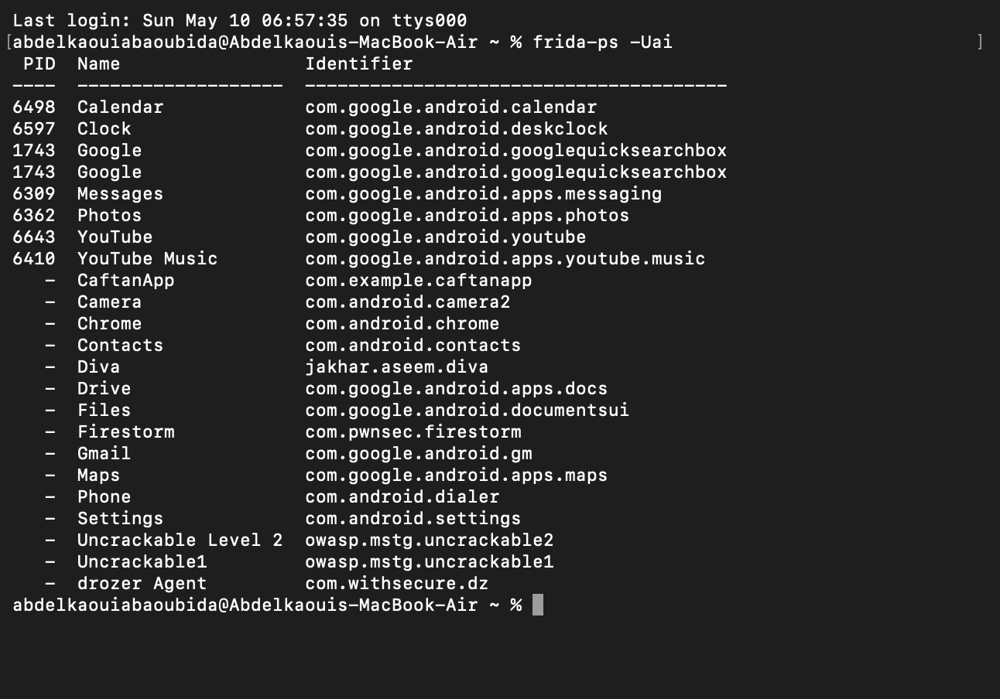
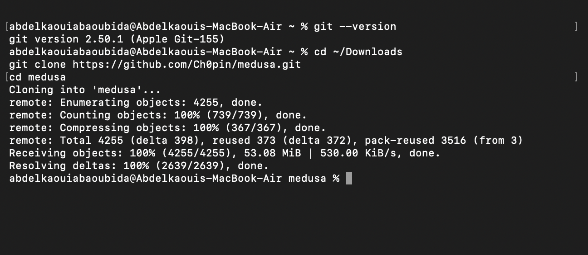
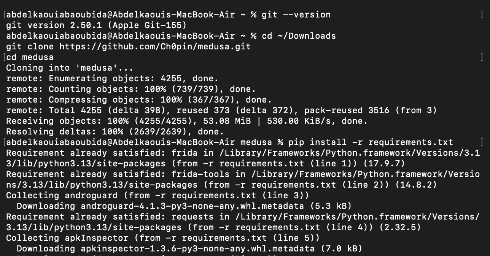
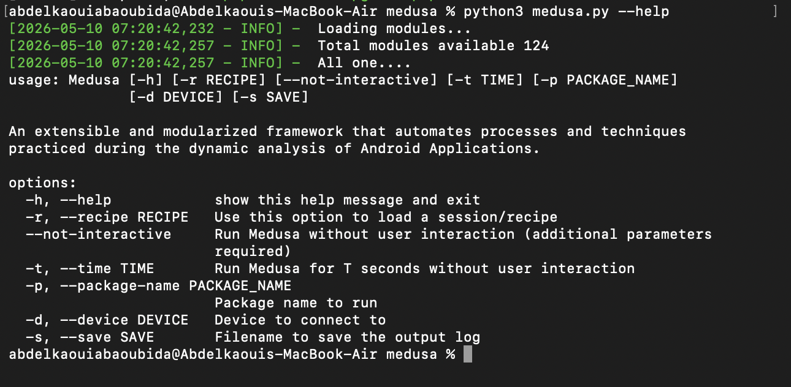
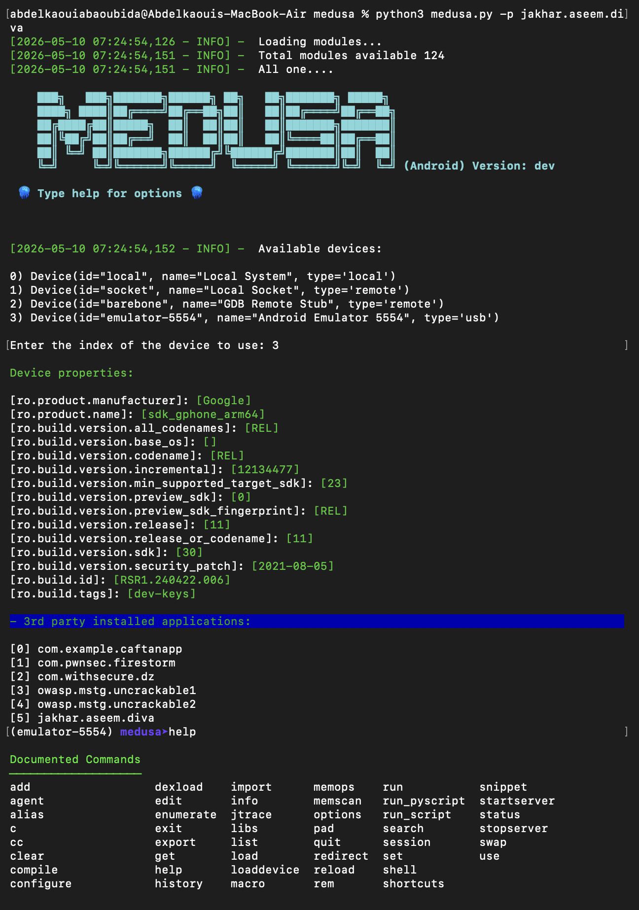
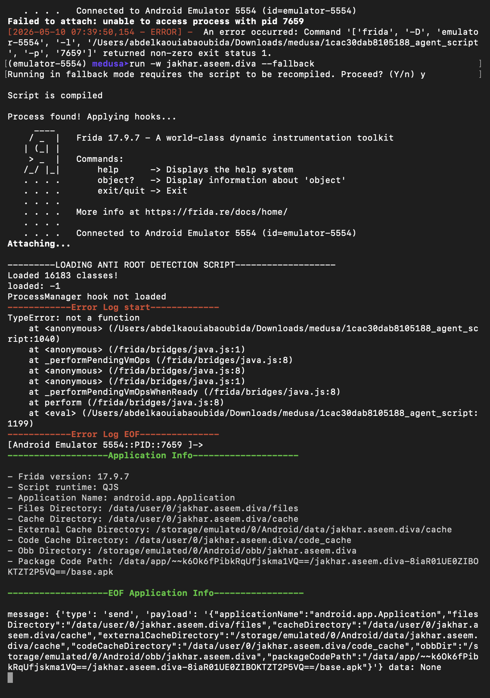
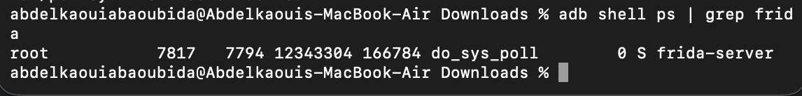

# Android Root Detection Bypass using Medusa & Frida

## Overview
This lab demonstrates how to bypass Android root detection using **Frida** and **Medusa** on an Android emulator.  
The objective was to:
- Configure Frida on the host machine and Android emulator.
- Deploy and run `frida-server`.
- Install and configure Medusa.
- Load a root detection bypass module.
- Attach Medusa to the vulnerable Android application **DIVA**.
- Validate that the instrumentation process works correctly.

---

# Environment Information

- **Host OS:** macOS ARM64
- **Python Version:** 3.13.2
- **Frida Version:** 17.9.7
- **Android Emulator:** Android Emulator 5554
- **Target Application:** DIVA
- **Target Package:** `jakhar.aseem.diva`

---

# Step 1 — Verifying Frida and Connected Applications

The first step was verifying that Frida could communicate with the Android emulator successfully.

Command used:

```bash
frida-ps -Uai
```

This command lists all installed and running applications detected through Frida.

## Screenshot



## Explanation
The output confirms:
- Frida is properly installed.
- The Android emulator is connected successfully.
- Multiple Android applications are visible through Frida.
- The target application `jakhar.aseem.diva` (DIVA) is detected.

---

# Step 2 — Installing Medusa

The Medusa framework was cloned from GitHub in order to perform automated Android instrumentation and root detection bypassing.

Commands used:

```bash
cd ~/Downloads
git clone https://github.com/Ch0pin/medusa.git
cd medusa
```

## Screenshot



## Explanation
The screenshot shows:
- Git is installed correctly.
- The Medusa repository was cloned successfully.
- The project files were downloaded without errors.

---

# Step 3 — Installing Medusa Dependencies

After cloning Medusa, the required Python dependencies were installed using the `requirements.txt` file.

Command used:

```bash
pip install -r requirements.txt
```

## Screenshot



## Explanation
The installation process downloaded and installed:
- Frida dependencies
- Android analysis libraries
- APK inspection utilities
- Additional Medusa runtime packages

This step prepares the environment for dynamic instrumentation.

---

# Step 4 — Verifying Medusa Installation

The Medusa CLI was tested to confirm proper installation.

Command used:

```bash
python3 medusa.py --help
```

## Screenshot



## Explanation
The screenshot confirms:
- Medusa loads successfully.
- 124 modules are available.
- The framework is operational.
- The available command-line options are displayed.

---

# Step 5 — Connecting Medusa to the Android Emulator

Medusa was launched and connected to the Android emulator containing the DIVA application.

Command used:

```bash
python3 medusa.py -p jakhar.aseem.diva
```

The Android emulator device was then selected from the list.

## Screenshot



## Explanation
This step confirms:
- Medusa detected the Android emulator.
- The emulator information was retrieved successfully.
- Installed third-party applications were enumerated.
- The DIVA application package was identified.

---

# Step 6 — Loading the Root Detection Bypass Module

The universal root detection bypass module was loaded and executed using Medusa fallback mode.

Command used:

```bash
run -w jakhar.aseem.diva --fallback
```

## Screenshot



## Explanation
The screenshot demonstrates:
- Medusa successfully attached to the DIVA process.
- Frida instrumentation initialized correctly.
- The anti-root detection script was injected.
- Application information was extracted dynamically.

Although some hook errors appeared, the instrumentation session remained active and functional.

---

# Step 7 — Verifying frida-server Execution

The final step verified that `frida-server` was running correctly on the Android emulator.

Command used:

```bash
adb shell ps | grep frida
```

## Screenshot



## Explanation
The screenshot confirms:
- `frida-server` is active.
- The process runs with root privileges.
- Frida instrumentation services are operational on the emulator.

---

# Troubleshooting Performed

During the lab, several issues were encountered and resolved:

| Problem | Solution |
|---|---|
| Unable to access process PID | Restarted ADB in root mode |
| Frida attachment failure | Used Medusa fallback mode |
| Process access denied | Restarted `frida-server` as root |
| Medusa injection instability | Used `run -w` with fallback mode |

---

# Conclusion

This lab successfully demonstrated:
- Android dynamic instrumentation using Frida.
- Deployment and management of `frida-server`.
- Automated instrumentation using Medusa.
- Root detection bypass preparation and hook injection.
- Android process instrumentation and debugging.

The environment is now ready for more advanced Android security testing, runtime analysis, SSL pinning bypass, and custom Frida hook development.
